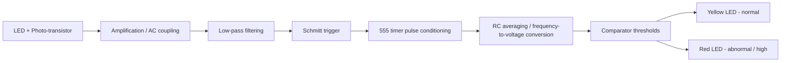

  <h1>Optical Heart Rate Monitor</h1>
  
<strong>An analog heart-rate monitoring prototype that senses pulse-driven changes in light transmission through a fingertip and converts them into a clean, thresholded output with visual indication.</strong>

  

    <kbd>Optical sensing</kbd>
    <kbd>Analog signal conditioning</kbd>
    <kbd>Schmitt trigger</kbd>
    <kbd>555 timer</kbd>
    <kbd>Comparator-based alerting</kbd>
  

> **Academic prototype:** This project was developed for learning, experimentation, and demonstration in biomedical instrumentation and analog circuit design. It is **not** a clinically calibrated medical device.

---

## Overview

This project uses an **LED and photo-transistor** to detect tiny changes in light intensity caused by blood volume variation in a fingertip during each heartbeat. Because the raw optical signal is small and noisy, the system processes it through a carefully staged analog pipeline: amplification, filtering, pulse shaping, timing, averaging, and threshold comparison.

The final design produces a stable output that can visually indicate whether pulse activity is within a normal range or has crossed an abnormal threshold. Rather than directly displaying BPM, the prototype converts pulse activity into a voltage level and compares it against experimentally selected thresholds.

### Why this project matters

- Demonstrates a full **sensor-to-output analog signal chain**
- Shows how weak biological signals can be extracted from noise
- Applies practical engineering solutions for **ambient light rejection**, **sensor placement**, and **safe low-voltage operation**
- Reinforces a disciplined **stage-by-stage design and debugging workflow**

---

## System Architecture

  

---

## How It Works

### 1. Optical sensing
A photo-transistor observes the amount of light transmitted through a fingertip. As blood volume changes with each heartbeat, the amount of absorbed light changes as well, creating a small pulse-related electrical signal.

### 2. Amplification and filtering
The raw sensor output is weak and noisy, so it is amplified and filtered to isolate the pulse-related waveform while suppressing unwanted noise and baseline disturbances.

### 3. Pulse shaping with a Schmitt trigger
The conditioned analog waveform is converted into clean digital pulses using hysteresis. This helps reject small fluctuations and noise that would otherwise create false detections.

### 4. 555 timer pulse conditioning
A 555 stage standardizes the pulse width and improves output consistency, making the next conversion stage more stable and repeatable.

### 5. Frequency-to-voltage conversion
An RC averaging network converts pulse frequency into a DC-like voltage. Faster pulse activity increases the average voltage; slower pulse activity lowers it.

### 6. Comparator-based indication
Comparator thresholds determine whether the measured pulse activity is normal or abnormal. In the demonstrated prototype, the **yellow LED** represents normal operation, while the **red LED** signals abnormally high pulse activity.

---

## Project Gallery

| Final Prototype | Example Signal Capture |
| --- | --- |
|  |  |

---

## Key Design Features

- **Low-voltage operation (5 V)** for safer testing around the human body
- **Opaque finger enclosure** to reduce ambient light interference
- **Threshold adjustment with potentiometers** for tuning system behavior
- **Comparator-driven LED indication** for immediate visual feedback
- **Stage-by-stage validation** to simplify troubleshooting and improve stability

---

## Results at a Glance

| Metric / Observation | Summary |
| --- | --- |
| Supply voltage | 5 V |
| Measured signal-to-noise ratio | ~23.64 dB |
| Approximate signal-to-noise voltage ratio | ~15:1 |
| Experimental calibration points | ~0.2 V with no finger, ~2.2 V with normal finger placement |
| Indicator behavior | Yellow LED = normal, Red LED = abnormal/high |
| Reliability testing | Four 6-hour test sessions over three days |
| Calibration status | Experimentally calibrated prototype, not clinically calibrated |

---

## Calibration and Testing Strategy

The project was validated using a **signal-path approach**, meaning each stage was built and tested individually before full integration.

### Typical validation flow
1. Observe the raw optical signal from the sensor
2. Tune amplification until the pulse envelope becomes visible
3. Adjust filtering to reduce noise while preserving the heartbeat waveform
4. Set Schmitt trigger thresholds for one clean pulse per heartbeat
5. Verify 555 output consistency
6. Measure RC-averaged voltage and use it to define comparator thresholds
7. Confirm LED behavior under normal and elevated pulse conditions

### Long-duration testing
The system was operated over multiple extended sessions to verify stable behavior. After debugging and rewiring issues, the full chain - from sensor to LED outputs - demonstrated repeatable operation across four 6-hour intervals over three days.

---

## Safety and Practical Considerations

- The circuit operates at a **safe low voltage** during use and testing.
- Current-limiting resistors help protect LEDs and other components.
- The optical sensor is enclosed to reduce both ambient light exposure and unwanted signal corruption.
- Components were monitored during testing, and power was removed immediately whenever overheating or wiring issues were suspected.
- This system should be treated as an **educational electronics prototype**, not a diagnostic instrument.

---

## Engineering Challenges and Lessons Learned

This project surfaced several realistic analog design challenges:

- **Ambient light sensitivity** could distort measurements without shielding
- **Finger pressure and positioning** strongly affected signal quality
- **Breadboard wiring reliability** had a direct impact on Schmitt trigger behavior
- **Component selection mistakes**, especially around capacitors, caused overheating and rework
- **IC pin mapping complexity** required careful verification during multi-stage implementation
- Rebuilding portions of the circuit improved robustness and highlighted the value of **systematic debugging**

These issues made the project more valuable as an engineering exercise because they exposed the gap between theoretical design and stable real-world performance.

---

## Major Building Blocks

- Optical sensor module (LED + photo-transistor)
- Multi-stage amplifier network
- Low-pass filter(s)
- Schmitt trigger stage
- 555 timer stage
- RC averaging / frequency-to-voltage stage
- Comparator stage
- LED indicators
- Breadboard-based prototype and oscilloscope validation setup

---

## Future Improvements

This prototype can be extended in several meaningful ways:

- Move from breadboard to a **PCB implementation** for greater reliability
- Build a **CAD-designed enclosure** for the sensor and electronics
- Improve the finger holder with a more ergonomic clip-on structure
- Add **better noise rejection** and more controlled sensor alignment
- Calibrate against a known reference such as a smartwatch or manual pulse count
- Add direct **BPM display or digital counting** for clearer user feedback
- Introduce adaptive thresholding or temperature compensation for improved consistency

---

## Team

**Group 10**

According to the report, the workload was shared across research, design, testing, debugging, enclosure development, and documentation. Circuit design centered heavily on Naman's contributions, while report writing and enclosure work were supported strongly by Annie and Rebeca, with all members participating in testing, troubleshooting, and design discussions.

---

## Takeaway

This project is a strong example of how a biomedical sensing concept can be implemented using classical analog building blocks. It demonstrates more than just heart-rate detection - it showcases the full engineering process of signal acquisition, conditioning, validation, calibration, troubleshooting, and refinement.

If you are exploring analog biomedical instrumentation, this project is a practical case study in turning a fragile biological signal into a usable and interpretable output.
